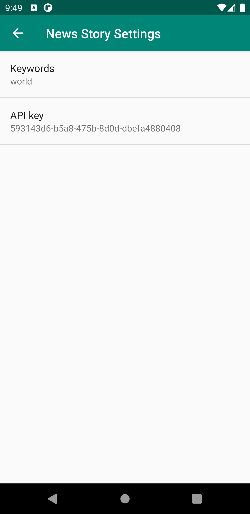

 
<h2 align="center"><b>The guardian feed app</b></h2>
<h4 align="center">A summary of news from the guardian website based on your own keywords.</h4>

<a href="#screenshots">Screenshots</a> &bull; <a href="#description">Description</a> &bull; <a href="#features">Features</a> &bull; <a href="#installation-and-updates">Installation and updates</a> &bull; <a href="#contribution">Contribution</a> &bull; <a href="#donate">Donate</a> &bull; <a href="#license">License</a>

## Screenshots

## Description

The guardian feed app is a wrapper for the website of the guardian. It allows you to have in one go the latest news on a specific topic from what is available on the guardian.
This application use the standard API for the guardian.

*Please note that we are not related to The guardian nor its affiliates*

### Features

* Input your own guardian API for the app use
* Specify your keywords
* Watch a lot of story on the guardian

## Installation and updates
Please use Android Studio to compile the application.
At the moment, we don't have an official APK yet.

## Contribution
Whether you have ideas, translations, design changes, code cleaning, or real heavy code changes, help is always welcome.
The more is done the better it gets!

If you'd like to get involved, send me a message.

## Privacy Policy

*Please note that we are not related to The guardian nor its affiliates.*

*The guardian is a trademark of the guardian media group*

## License
  

The guardian feed app is Free Software: You can use, study share and improve it at your
will. Specifically you can redistribute and/or modify it under the terms of the
[GNU General Public License](https://www.gnu.org/licenses/gpl.html) as
published by the Free Software Foundation, either version 3 of the License, or
(at your option) any later version.  
